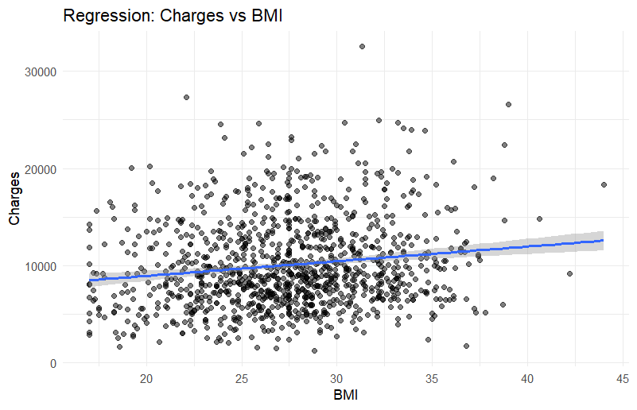
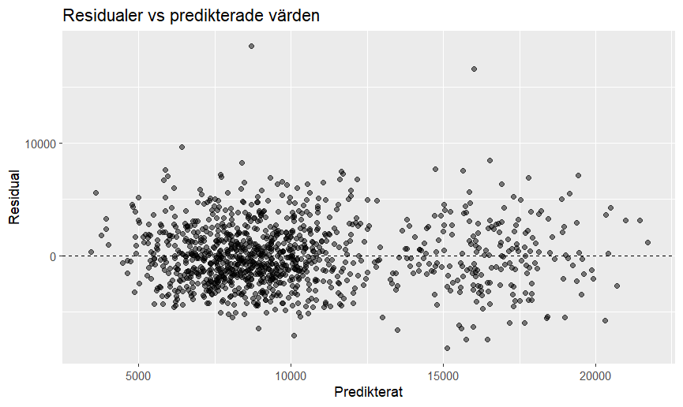
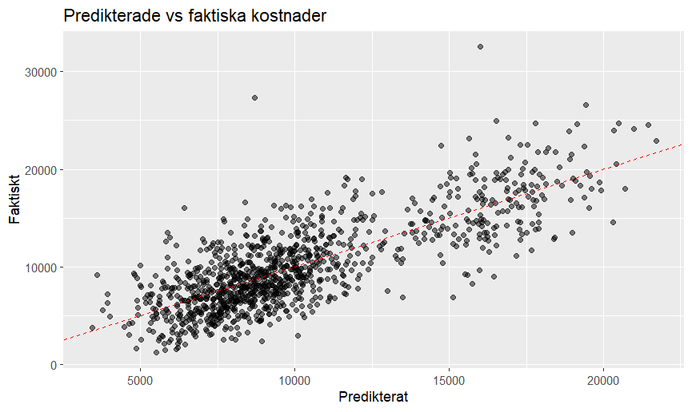

```{r}
library(tidyverse)
insurance_raw <- read.csv("../data/insurance_costs.csv")
source("../scripts/02_prepare_data.R")
source("../scripts/03_analysis.R")
source("../scripts/04_figures.R")
source("../scripts/05_regression_models.R")
```

# Introduktion

I den här rapporten analyseras **försäkringskostnader**. Fokus ligger på att analysera data för att undersöka vilka variabler som verkar hänga ihop med försäkringskostnaderna mest. Målet är inte bara att beskriva data, utan också att genomföra en regressionsanalys i R, tolka resultaten och diskutera hur modellen fungerar som beslutsstöd.

# Resultat

```{r}
charges_smoker
```

```{r}
p_distribution
```

Histogrammet visar att **försäkringskostnaderna är skevt fördelade.** De flesta kunder har kostnader mellan cirka 5 000 och 15 000, medan ett mindre antal kunder har betydligt högre kostnader. Detta tyder på **stor variation** i datasetet.

```{r}
p_charges_vs_smoker
```

Boxploten visar **tydliga skillnader mellan rökare och icke-rökare**. Rökare har både högre median och större spridning i kostnader, vilket indikerar att rökning är en viktig faktor bakom högre försäkringskostnader.

```{r}
charges_risk
```

```{r}
p_charges_vs_risk
```

Kunder med hög risknivå har högst median kostnader, medan kunder med låg risknivå har lägst. Detta tyder på att **tidigare historik och riskklassificering påverkar** försäkringskostnaderna.

```{r}
charges_bmi
```

```{r}
p_bmi_vs_charges
```

Figuren visar ett **positivt samband mellan BMI och försäkringskostnader**. Den stigande regressionslinjen indikerar att högre BMI tenderar att vara kopplat till högre kostnader, även om variationen är relativt stor.

```{r}
charges_age
```

```{r}
p_charges_vs_age
```

Äldre kunder, särskilt gruppen **Senior**, har generellt **högre kostnader** än yngre grupper. Detta tyder på att ålder har betydelse för försäkringskostnaderna.

```{r}
smoker_test
```

**T-testet** visar en statistiskt signifikant skillnad i genomsnittliga kostnader mellan rökare och icke-rökare. Rökare har betydligt högre genomsnittliga försäkringskostnader än icke-rökare. Detta stärker slutsatsen att **rökning är en viktig faktor** bakom högre kostnader.

```{r}
sex_test
```

**T-testet** visar ingen statistiskt signifikant skillnad i kostnader mellan kvinnor och män (p = 0.702). Det tyder på att **kön inte verkar ha någon tydlig påverkan** på försäkringskostnaderna i detta dataset.

# Frågor och svar

**Hur är kostnaderna fördelade?**

Försäkringskostnaderna är ojämnt fördelade. De flesta kunder har kostnader i mittennivåer, medan ett mindre antal kunder har mycket höga kostnader. Detta innebär att variationen i datasetet är relativt stor.

**Vilka variabler verkar intressanta att undersöka vidare?**

De variabler som visar tydligast samband med kostnader är **rökning, risknivå, BMI och ålder**. Dessa variabler visar skillnader både i tabeller och figurer och valdes därför vidare till **regressionsanalysen**.

**Finns det tydliga skillnader mellan grupper?**

Ja. Rökare har tydligt högre kostnader än icke-rökare. Kunder med hög risknivå har högre kostnader än kunder med låg risknivå. Äldre kunder har generellt högre kostnader än yngre grupper. Däremot syns ingen tydlig skillnad mellan kvinnor och män.

# Regressionsanalys

```{r}
model_1
```

Modell 1 förklarade cirka **58 %** av variationen i kostnaderna (R² = 0.582).

Resultatet visade att:

-   högre ålder är kopplat till högre kostnader
-   högre BMI är kopplat till högre kostnader
-   rökare har betydligt högre kostnader än icke-rökare
-   kunder med låg eller medel risknivå har lägre kostnader än kunder med hög risknivå

Rökning hade den starkaste effekten i modellen.

```{r}
model_2
```

Modell 2 förklarade cirka **62 %** av variationen (R² = 0.620).

-   förklaringsgraden förbättrades något jämfört med modell 1, vilket visar att de extra variablerna bidrar med information
-   region hade däremot ingen tydlig statistisk effekt, medan motionsnivå och försäkringsplan hade viss betydelse
-   modell 2 bedömmer jag som den mest användbara modellen eftersom den kombinerar god förklaringsgrad med flera relevanta variabler.

```{r}
model_3
```

Modell 3 testade **history_score istället för risk_level**. Detta gjordes för att undersöka om tidigare skadehistorik kunde ge bättre förklaring av kostnader. Modellen gav liknande resultat men förbättrade inte modellen tydligt jämfört med Modell 2.

# Vilka variabler hade störst betydelse?

1.  Rökning
2.  Risknivå / skadehistorik
3.  BMI
4.  Ålder

# Modelutvärdering



Grafen visar ett positivt samband mellan BMI och kostnader, men sambandet är inte perfekt linjärt och variationen är relativt stor.



Residualerna ligger relativt jämnt kring nollinjen, vilket tyder på att modellen fungerar rimligt bra. Viss spridning finns dock vid högre kostnader.



De flesta observationer ligger nära diagonalen, vilket visar att modellen ofta ger rimliga prediktioner. Några större avvikelser finns för extrema värden.

# Begränsningar

Modellen fångar inte all variation i kostnaderna eftersom cirka **38 % fortfarande är oförklarat.**

Det kan bero på att viktig information saknas, exempelvis:

-   inkomst
-   typ av sjukdom
-   genetiska faktorer
-   vårdbehov
-   geografiska prisnivåer
-   tidigare medicinska behandlingar

# Slutsats

1.  Analysen visar att **försäkringskostnader främst påverkas av rökning, risknivå, BMI och ålder**.

2.  Rökning hade starkast samband med höga kostnader. Även högre BMI och högre ålder ökade kostnaderna.

3.  Regressionsmodellen fungerade relativt bra som beslutsstöd och kunde förklara **en stor del av variationen, men inte allt.**

4.  För framtida förbättringar hade fler variabler, alternativ modellspecifikation och eventuellt mer avancerade modeller kunnat testas eftersom:

    -   modellen fångar mycket men inte allt

    -   vissa faktorer saknas

    -   region inte verkar bidra tydligt

    -   variation fortfarande är oförklarad

# Självreflektion och avslut

Tre regressionsmodeller testades i analysen för att undersöka vilken modell som bäst kunde förklara variationen i försäkringskostnader. Model 2 valdes som huvudmodell eftersom den hade högst förklaringsgrad av de testade modellerna och samtidigt innehöll flera relevanta variabler. Modellen gav en bättre helhetsbild av vilka faktorer som påverkar kostnaderna utan att bli alltför svår att tolka. Den kombinerar därför god prediktionsförmåga med tydlig tolkbarhet.

Trots att modellen förklarar en stor del av variationen fångar den inte alla orsaker bakom försäkringskostnaderna. Exempel på faktorer som saknas i datasetet kan vara:

-   specifika medicinska diagnoser
-   inkomstnivå
-   genetiska riskfaktorer
-   vårdkonsumtion
-   livsstil utöver rökning och motion
-   framtida oförutsedda händelser

Det innebär att modellen inte kan förklara alla individuella skillnader.

Trots begränsningarna ger modellen värdefull information om vilka faktorer som tydligast hänger ihop med kostnader. **Resultaten kan användas som beslutsstöd vid prissättning, riskbedömning och vidare analys.**

Särskilt sambanden mellan rökning, BMI, ålder och risknivå framstår som stabila och rimliga.

*Jag bedömer att arbetet motsvarar VG eftersom jag inte bara genomförde en grundläggande analys, utan även jämförde flera regressionsmodeller, motiverade modellval, utvärderade modellernas anpassning och diskuterade styrkor, svagheter och begränsningar i analysen precis som läraren tipsade om under lektionerna. Hela workflowet och ordningen i projektet (mappar/filer) är baserat på lärarens rekomendationer i youtube videorna. Jag lärde mig otroligt mycket under detta projekt samt grupparbetet och fördjupade mig i RStudio tack vore kursen samt boken "R for Data Science".*
